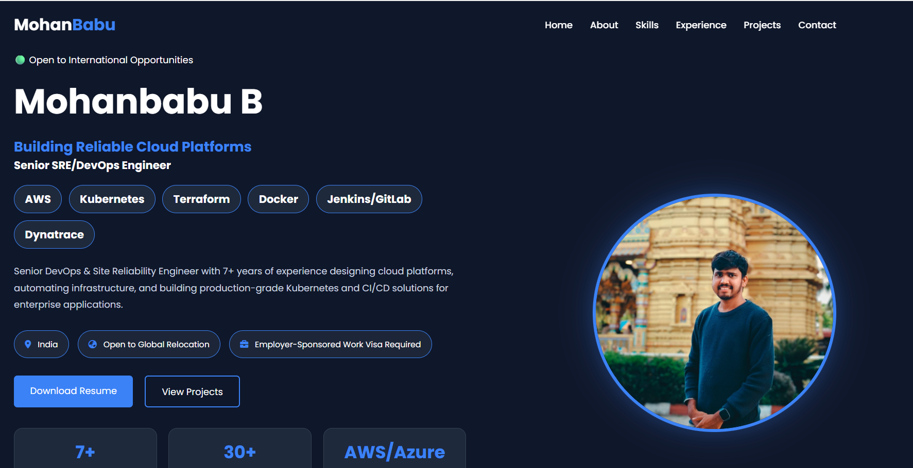
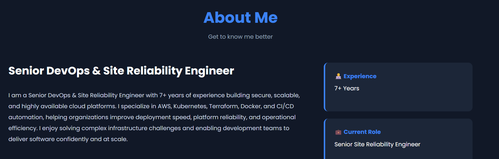
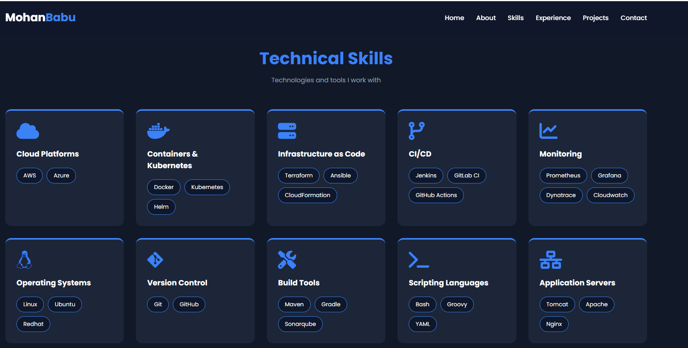
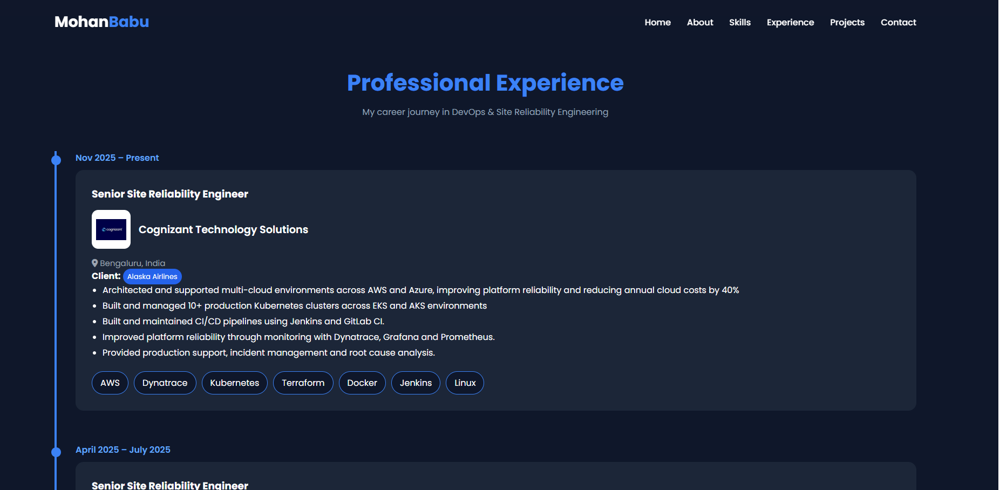

# Mohan Babu Portfolio

Professional portfolio website of Mohan Babu, Senior DevOps & Site Reliability Engineer.

## Technologies

- HTML5
- CSS3
- JavaScript
- GitHub Pages

# 🌐 Personal Portfolio Website

A modern, responsive portfolio website showcasing my experience as a **Senior DevOps & Site Reliability Engineer** with 7+ years of experience in AWS, Kubernetes, Terraform, Docker, CI/CD, and Cloud Infrastructure.

The portfolio highlights my professional experience, technical skills, DevOps projects, certifications, and contact information. It is deployed using **GitHub Pages** and containerized with **Docker & Nginx**.

---

## 🚀 Live Portfolio

🔗 **Website:** https://bmohanbabu.github.io/

---

## 👨‍💻 About Me

I'm a Senior DevOps & Site Reliability Engineer with expertise in:

- AWS & Azure Cloud
- Kubernetes (EKS & AKS)
- Docker
- Terraform
- Jenkins & GitLab CI/CD
- Infrastructure as Code (IaC)
- Monitoring & Observability
- Linux Administration
- Automation & Scripting

I'm currently **open to international DevOps & SRE opportunities** requiring employer-sponsored work visas.

---

## ✨ Features

- Modern Responsive UI
- Professional Hero Section
- About Me
- Technical Skills
- Professional Experience Timeline
- DevOps Project Showcase
- Contact Section
- Resume Download
- GitHub Pages Hosting
- Dockerized with Nginx

---

## 🛠 Tech Stack

| Category | Technologies |
|----------|--------------|
| Frontend | HTML5, CSS3, JavaScript |
| Icons | Font Awesome |
| Containerization | Docker |
| Web Server | Nginx |
| Hosting | GitHub Pages |
| Version Control | Git & GitHub |

---

## 🐳 Docker Support

### Build the Docker image

```bash
docker build -t portfolio:v1 .
```

### Run the container

```bash
docker run -d -p 8080:80 portfolio:v1
```

Open your browser:

```
http://localhost:8080
```

---

## 📂 Project Structure

```
portfolio/
│
├── assets/
│   ├── css/
│   ├── images/
│   ├── js/
│   └── resume/
│
├── index.html
├── Dockerfile
├── .dockerignore
├── README.md
└── docker-compose.yml
```

---

## 📸 Screenshots

### Home



### About



### Skills



### Experience



### Contact

*(Add screenshot here)*

---

## 📬 Contact

### Career Opportunities

📧 mohanbabub09@gmail.com

### Training & Collaboration

📧 catchdevops@gmail.com

### LinkedIn

https://www.linkedin.com/in/mohanbabudevops/

### GitHub

https://github.com/bmohanbabu

### YouTube

https://www.youtube.com/@Techwonders_mb

---

## 📄 License

This project is open source and available under the MIT License.
